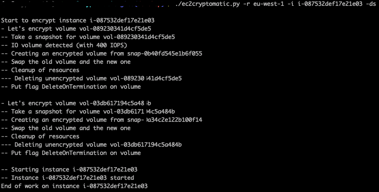

# EC2Cryptomatic

Encrypt EBS volumes from AWS EC2 instances

**A serverless version of this script exists here:** https://github.com/jbrt/ec2cryptomatic-serverless

**EC2Cryptomatic will evolve soon (since now it's possible to encrypt EBS volumes more easily).**
https://aws.amazon.com/about-aws/whats-new/2019/05/launch-encrypted-ebs-backed-ec2-instances-from-unencrypted-amis-in-a-single-step/

## Description

This tool let you :
- Encrypt all the EBS volumes for an instance
- Duplicate all the source tags to the target
- Apply DeleteOnTermination flag if needs
- Preserve the original volume or not as an option (thank to @cobaltjacket)
- Start each instance after encrypting is complete (thank to @dshah22)

For your information, the workflow used to encrypt a EBS volume is:
- Take a snapshot from the original volume
- Copy and encrypt that snapshot
- Create a new volume from that encrypted snapshot
- Swap the volumes
- Do some cleaning

## Prerequisites

Before using this tool you have to install the python AWS SDK Boto3 on your
EC2 instance. You can use pip for that and the requirement file:

`pip install -r requirements.txt`

Then, I recommend you to create an dedicated IAM Role with the IAM policy
below. This script do not use Access Keys because i prefer avoid them.
Remember: ***Access Key are just a login and a password in the wild...***

```json
{
    "Version": "2012-10-17",
    "Statement": [
        {
            "Sid": "Stmt1504425390448",
            "Action": [
                "ec2:AttachVolume",
                "ec2:CopyImage",
                "ec2:CopySnapshot",
                "ec2:CreateSnapshot",
                "ec2:CreateVolume",
                "ec2:CreateTags",
                "ec2:DeleteSnapshot",
                "ec2:DeleteVolume",
                "ec2:DescribeInstances",
                "ec2:DescribeSnapshots",
                "ec2:DescribeVolumes",
                "ec2:DetachVolume",
                "ec2:ModifyInstanceAttribute",
		"ec2:StartInstances"
            ],
            "Effect": "Allow",
            "Resource": "*"
        }
    ]
}

```

## Syntax

Here is the syntax of ec2cryptomatic. You have to specify a AWS region name
and one or more instance ID.

```
usage: ec2cryptomatic.py [-h] -r REGION -i INSTANCES [INSTANCES ...] [-k KMS-KEY] [-ds]

EC2Cryptomatic - Encrypt EBS volumes from EC2 instances

optional arguments:
  -h, --help            show this help message and exit
  -r REGION, --region REGION
                        AWS Region
  -i INSTANCES [INSTANCES ...], --instances INSTANCES [INSTANCES ...]
                        Instance to encrypt
  -k KEY, --kms-key KEY 
                        KMS Key to be used for encryption
  -ds, --discard_source
                        Discard source volume after encryption (default:
                        False)
```

## Docker

You can build a Docker image of that tool with the Dockerfile provided in 
this repository :

`docker build -t ec2cryptomatic:latest .`

Or you can use the image already pulled into the official Docker Hub:

`docker pull jbrt/ec2cryptomatic`

## Example

Each instance will be encrypted one by one (you may specify one or more
instance-id (do not use commas, only spaces) after the -i flag) :



## License

This project is under GPL3 license
